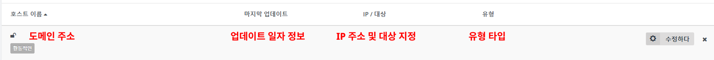

### 1. 이메일 제출

```cmd
Saving debug log to /var/log/letsencrypt/letsencrypt.log
Enter email address (used for urgent renewal and security notices)
(Enter 'c' to cancel):
```

### 2. 약관 읽고 동의

```cmd
- - - - - - - - - - - - - - - - - - - - - - - - - - - - - - - - - - - - - - - -
Please read the Terms of Service at
https://letsencrypt.org/documents/LE-SA-v1.2-November-15-2017.pdf. You must
agree in order to register with the ACME server. Do you agree?
- - - - - - - - - - - - - - - - - - - - - - - - - - - - - - - - - - - - - - - -
(Y)es/(N)o:
```

### 3. 추가 약관 동의 

> 번역해보면 certbot 사용해보고 이메일을 Electronic Frontier Foundation 에 제출할 의향이 있냐는 질문인데, ... N 를 눌러도 진행은 됩니다. `2022-08-05`

```cmd
- - - - - - - - - - - - - - - - - - - - - - - - - - - - - - - - - - - - - - - -
Would you be willing, once your first certificate is successfully issued, to
share your email address with the Electronic Frontier Foundation, a founding
partner of the Let's Encrypt project and the non-profit organization that
develops Certbot? We'd like to send you email about our work encrypting the web,
EFF news, campaigns, and ways to support digital freedom.
- - - - - - - - - - - - - - - - - - - - - - - - - - - - - - - - - - - - - - - -
```

### 4. 등록되어 있는 도메인 입력

```cmd
Account registered.
Please enter the domain name(s) you would like on your certificate (comma and/or
space separated) (Enter 'c' to cancel):
```

#### 4.1. ⭕ 성공하는 경우

```cmd
Saving debug log to 로그-파일-경로
Please enter the domain name(s) you would like on your certificate (comma and/or
space separated) (Enter 'c' to cancel): 도메인-주소-명
Requesting a certificate for 도메인-주소-명

Successfully received certificate.
Certificate is saved at: 이 경로가 `공개키` 주소입니다.
Key is saved at:         이 경로가 `비밀키` 주소입니다.
This certificate expires on 2022-11-03.
These files will be updated when the certificate renews.
Certbot has set up a scheduled task to automatically renew this certificate in the background.

Deploying certificate
Successfully deployed certificate for 도메인-주소-명 to 상위-디폴트-경로/default
Congratulations! You have successfully enabled HTTPS on https://도메인-주소-명

- - - - - - - - - - - - - - - - - - - - - - - - - - - - - - - - - - - - - - - -
If you like Certbot, please consider supporting our work by:
 * Donating to ISRG / Let's Encrypt:   https://letsencrypt.org/donate
 * Donating to EFF:                    https://eff.org/donate-le
- - - - - - - - - - - - - - - - - - - - - - - - - - - - - - - - - - - - - - - -
```

#### 4.1. ❌ 실패하는 경우

도메인 발급처에서, 해당 도메인과 매핑할 IP 를 지정해주지 않으면 `다음과 같은` 가 발생합니다.



```cmd
Requesting a certificate for 도메인 주소

Certbot failed to authenticate some domains (authenticator: nginx). The Certificate Authority reported these 
problems:
  Domain: 도메인 주소
  Type:   dns
  Detail: DNS problem: NXDOMAIN looking up A for 도메인 주소 - check that a DNS record exists for this domain; DNS problem: NXDOMAIN looking up AAAA for 도메인 주소 - check that a DNS record exists for this domain

Hint: The Certificate Authority failed to verify the temporary nginx configuration changes made by Certbot. Ensure the listed domains point to this nginx server and that it is accessible from the internet.

Some challenges have failed.
Ask for help or search for solutions at https://community.letsencrypt.org. See the logfile /var/log/letsencrypt/letsencrypt.log or re-run Certbot with -v for more details.
```