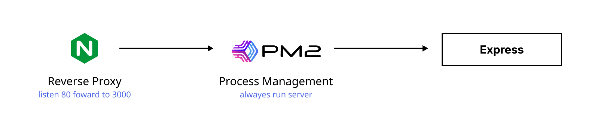

# Express-Nginx

> - 클론 원본 저장소 : [unchpatered/express-nginx](https://github.com/unchaptered/express-nginx)

ubuntu 의 iptable 포트포워드 기능을 조금 더 알아보다가 `Nginx` 를 알게 되었습니다.

그 와중에 [C10k 문제](https://en.wikipedia.org/wiki/C10k_problem) 를 알게 되고 이를 개선할 수 있다는 점에 매력을 느꼈습니다.

따라서 본 프로젝트에서는 다음을 목표로 하고 있습니다.

1. `ubuntu@22.04` 에서 Node, Git, PM2 등을 설정
2. `ubuntu@22.04` 에서 Snap 을 이용하여 Nginx 을 설정
3. Nginx 를 가동 시키고 **redirect 80 -> 3000** 설정
4. PM2 를 가동시키고 3000 포트에 express 서버 가동

- 목차 
    - [✔ 이론 공부](./README.md#✔-이론-공부)
    - [✔ 작업 절차](./README.md#✔-작업-절차)
    - [✔ 참고 자료](./README.md#✔-참고-자료)

 

 

### ✔ 이론 공부

아주 간단한 **Hello, World** 서버를 통해서 Nginx 와 PM2 의 기본을 실습하고 있습니다.

여기서 생소한 개념인 Nginx 에 대해서 궁금하시다면, 다음의 `영문 Gist` 를 참고하시거나 구글링을 해주세요.

> Nginx 란 무엇일까?
> 
> - [Nginx 란?, ENG](https://gist.github.com/unchaptered/d534826205517bf1e08311df57e02d66)
> - [Proxy Server 란?, ENG](https://gist.github.com/unchaptered/d53403dbba2b99cb808d9d9adc41ce33)
> - [Foward Proxy Server 란?, ENG](https://gist.github.com/unchaptered/a9e684ab95cef2ed8d8f3838b6264d25)
> - [Reverse Proxy Server 란?, ENG](https://gist.github.com/unchaptered/b13ace153fc948dbbf43d865fbe7766c)

 

 

### ✔ 작업 절차

1. [AWS sudo 환경 설정](./aws.set.md)
    1. [Nginx Install 시 ❌ 에러 발생](./nginx.install.md)
    2. [Nginx Start 시  ❌ 에러 발생](./nginx.start.md)
2. [AWS 보안 그룹 설정](./aws.security.md)

 

 

### ✔ 참고 자료

- Bad / [Nginx를 리버스 프록시로 사용해보자 (EC2 + Nginx + express)](https://darrengwon.tistory.com/546)
- Reverse Proxy / [⭐ AWS와 Ubuntu로 nginx reverse-proxy와 pm2로 nodejs 무중단 서비스 만들기](https://velog.io/@pinot/AWS-Ubuntu%EB%A1%9C-nginx-reverse-proxy-%EC%84%A4%EC%A0%95%ED%95%98%EA%B8%B0)
- Reverse Proxy + https(TLS) / [⭐⭐ AWS EC2 + NginX + Nodejs Express](https://junojunho.com/front-end/aws-nginx-express)
- Reverse Proxy + https(TLS) / [⭐⭐ Node js에 관한 것 아무거나 3편, Node에서 NGINX를 리버스 프록시로 사용하기 (번역)](https://velog.io/@jakeseo_me/Node%EC%97%90%EC%84%9C-NGINX%EB%A5%BC-%EB%A6%AC%EB%B2%84%EC%8A%A4-%ED%94%84%EB%A1%9D%EC%8B%9C%EB%A1%9C-%EC%82%AC%EC%9A%A9%ED%95%98%EA%B8%B0-%EB%B2%88%EC%97%AD)